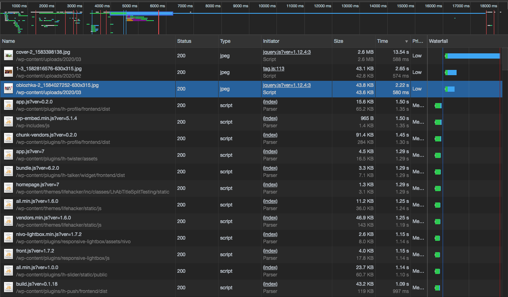

# Network

## Повторяющиеся ресурсы 

1. только adsbygoogle.js

## Лишний размер ресурсов

1. Картинки 

Простой imageOptim сжимает от 10% до 23%. С настройками можно ужать от 30%. Ну и 2500 × 1250 для 15" экрана перебор. до 80%

## Медленно загружающиеся ресурсы

1. Все что приходит с /wp-content/plugin

## Ресурсы, блокирующие загрузку

- В основном это блокирующий CSS

## Время до событий FP, FCP, FMP

- FP 2774ms

- FMP: 3674ms

- DCL: 5035ms

- L: 16194ms

## Loading, Scripting, Rendering, Painting

(тут у меня знатно подвисает ноутбук, если разкрывать детализацию по скриптингу)

## Coverage

1. CSS unused: 391kb
2. JS unused: 1.4mb

